# Software-Lab10 — Bot CLI de Métricas

Herramienta de línea de comandos que consume los logs estructurados (JSONL) que producen los microservicios bajo [backend/services/](backend/services/) y entrega métricas de disponibilidad, latencia, tendencias gráficas y estadísticas generales.

Los logs viven en `backend/logs/{module}/{YYYY-MM-DD}.jsonl` y son emitidos automáticamente por `LoggingMiddleware` y `latency_block` (ver [backend/services/commons/](backend/services/commons/)) cada vez que los servicios atienden tráfico.

---

## Setup

El bot no requiere instalación adicional — solo el `.venv` del proyecto (FastAPI / httpx / pydantic-settings, ya configurado).

```bash
cd backend
source ../.venv/bin/activate      # opcional, para usar `python` en vez del path completo
python -m bot --help
```

Atajo recomendado (alias permanente en `~/.zshrc` o `~/.bashrc`):

```bash
alias bot='cd /home/luisd/UTEC/ciclo_10/arquitectura/semana10/Software-Lab10/backend && /home/luisd/UTEC/ciclo_10/arquitectura/semana10/Software-Lab10/.venv/bin/python -m bot'
```

Con eso, todos los ejemplos de abajo se pueden invocar como `bot <Comando> ...` desde cualquier directorio.

---

## Sintaxis general

```
python -m bot <Comando> <Módulo> [opciones de tiempo]
```

**Comandos disponibles**: `CheckAvailability`, `CheckLatency`, `RenderGraph`, `Stats`.

**Módulos disponibles** (case-insensitive, se aceptan variantes con guion/underscore/singular):

| Alias del bot | Módulo canónico   | Servicio (puerto local) |
|---------------|-------------------|-------------------------|
| `PokeApi`     | `poke-api`        | 8001                    |
| `PokeStats`   | `poke-stats`      | 8002                    |
| `PokeImages`  | `poke-images`     | 8003                    |
| `SearchApi`   | `search-api`      | 8000                    |

**Opciones de tiempo** (elegir una):

| Forma                              | Significado                                   |
|------------------------------------|-----------------------------------------------|
| `--last 5d` / `--last 24h`         | Últimos N días (u horas, redondeadas a día)   |
| `-Last5Days` (compacto)            | Equivalente a `--last 5d`                     |
| `--from 01/10 --to 03/10`          | Rango DD/MM (año actual implícito)            |
| `--from 2026-05-25 --to 2026-05-30`| Rango ISO `YYYY-MM-DD`                        |
| sin nada                           | Solo el día de hoy                            |

---

## Comandos

### `CheckAvailability`

Imprime, por cada día del rango, el porcentaje de disponibilidad del módulo:

```
availability = requests_2xx / (requests_2xx + requests_5xx)
```

Los 3xx/4xx no cuentan ni como éxito ni como error. Si no hubo tráfico ese día → `N/A`.

**Sintaxis**:

```bash
python -m bot CheckAvailability <Módulo> [opciones de tiempo]
```

#### Evidencia por servicio

**`PokeApi`** — `python -m bot CheckAvailability PokeApi --last 6d`

```
25/05 68.9%
26/05 68.9%
27/05 68.9%
28/05 68.9%
29/05 68.9%
30/05 68.9%
```

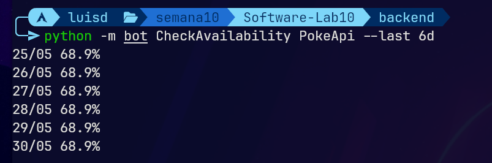

**`PokeStats`** — `python -m bot CheckAvailability PokeStats --last 6d`

```
25/05 62.2%
26/05 62.2%
27/05 62.2%
28/05 62.2%
29/05 62.2%
30/05 62.2%
```

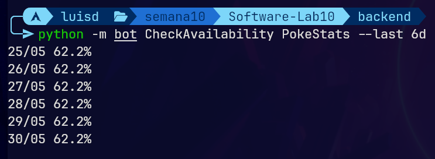

**`PokeImages`** — `python -m bot CheckAvailability PokeImages --last 6d`

```
25/05 100.0%
26/05 100.0%
27/05 100.0%
28/05 100.0%
29/05 100.0%
30/05 100.0%
```

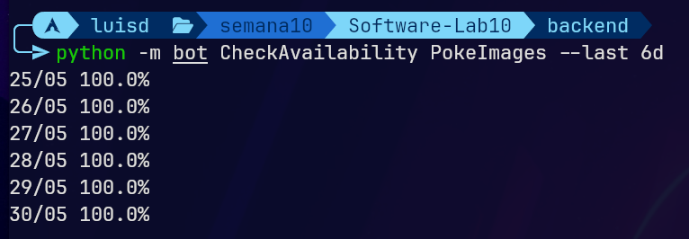

**`SearchApi`** — `python -m bot CheckAvailability SearchApi --last 6d`

```
25/05 52.4%
26/05 52.4%
27/05 52.4%
28/05 52.4%
29/05 52.4%
30/05 52.4%
```

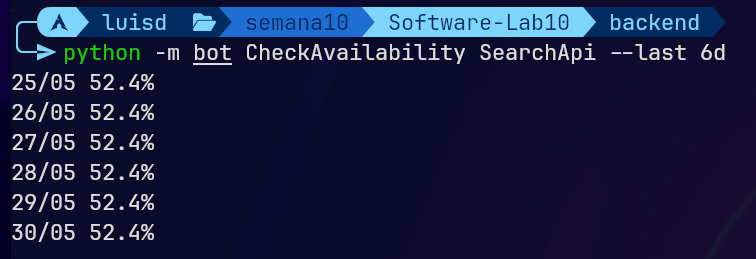

---

### `CheckLatency`

Imprime, por cada día del rango, la latencia promedio (`duration_ms`) de los requests del módulo (en milisegundos enteros). `N/A` si el día no tuvo tráfico.

**Sintaxis**:

```bash
python -m bot CheckLatency <Módulo> [opciones de tiempo]
```

#### Evidencia por servicio

**`PokeApi`** — `python -m bot CheckLatency PokeApi --last 6d`

```
25/05 9184ms
26/05 8599ms
27/05 5992ms
28/05 8120ms
29/05 6396ms
30/05 7520ms
```

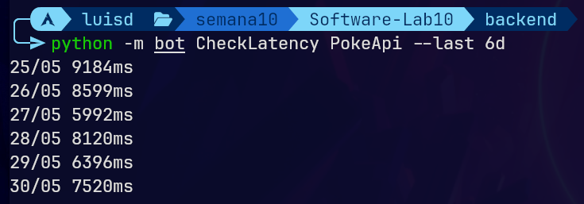

**`PokeStats`** — `python -m bot CheckLatency PokeStats --last 6d`

```
25/05 7807ms
26/05 7969ms
27/05 8707ms
28/05 7686ms
29/05 6420ms
30/05 7401ms
```

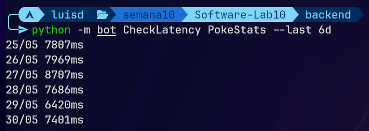

**`PokeImages`** — `python -m bot CheckLatency PokeImages --last 6d`

```
25/05 15ms
26/05 13ms
27/05 11ms
28/05 15ms
29/05 16ms
30/05 14ms
```

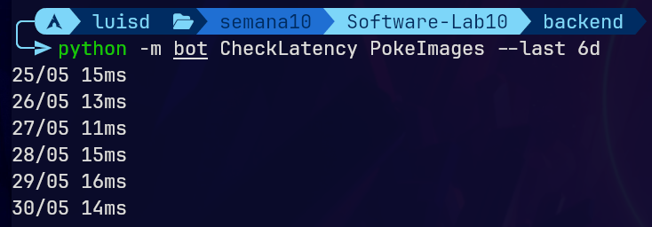

**`SearchApi`** — `python -m bot CheckLatency SearchApi --last 6d`

```
25/05 10560ms
26/05 17220ms
27/05 13004ms
28/05 18075ms
29/05 17767ms
30/05 13907ms
```


---

### `RenderGraph`

Renderiza un gráfico de líneas ASCII (~12 filas de alto) con la tendencia diaria de disponibilidad o latencia. Las etiquetas del eje X son verticales (se leen de arriba a abajo: cada columna es un día `DD/MM`).

**Sintaxis**:

```bash
python -m bot RenderGraph <Módulo> [--metric availability|latency] [opciones de tiempo]
```

`--metric` default: `availability`.

#### Evidencia por servicio

**`PokeApi`** — `python -m bot RenderGraph PokeApi --metric latency --last 6d`

```
poke-api - latencia (ms)
 9183.5┤•     
       │·     
       │·     
       │··•   
       │·· ·  
       │·· ·  
 6987.6┤·· ·• 
       │ · • ·
       │ ·   ·
       │ ·   •
       │ ·    
 5991.6┤ •    
       └──────
        222223
        567890
        //////
        000000
        555555
```

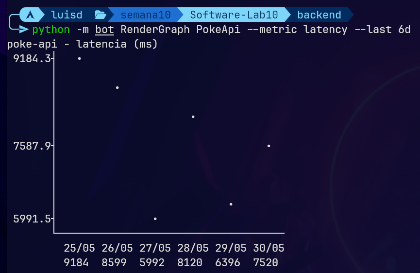

**`PokeStats`** — `python -m bot RenderGraph PokeStats --metric availability --last 6d`

```
poke-stats - disponibilidad (%)
   65.3┤      
       │      
       │      
       │      
       │      
       │••••••
   62.2┤      
       │      
       │      
       │      
       │      
   59.1┤      
       └──────
        222223
        567890
        //////
        000000
        555555
```

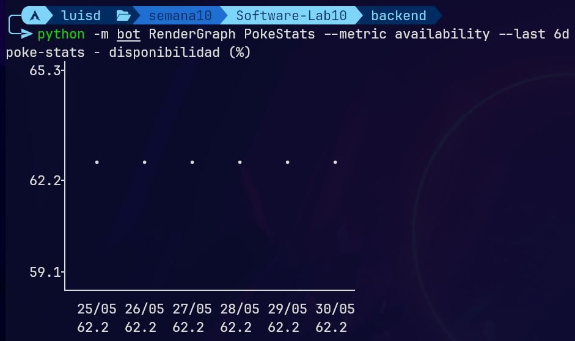

**`PokeImages`** — `python -m bot RenderGraph PokeImages --metric latency --last 6d`

```
poke-images - latencia (ms)
   16.0┤    • 
       │   ·· 
       │   ·· 
       │•  ·• 
       │·  ·  
       │·• ·  
   13.5┤··•·  
       │·· ·  
       │·· ·  
       │ · ·  
       │ · ·  
   11.0┤ · •  
       └──────
        222223
        567890
        //////
        000000
        555555
```

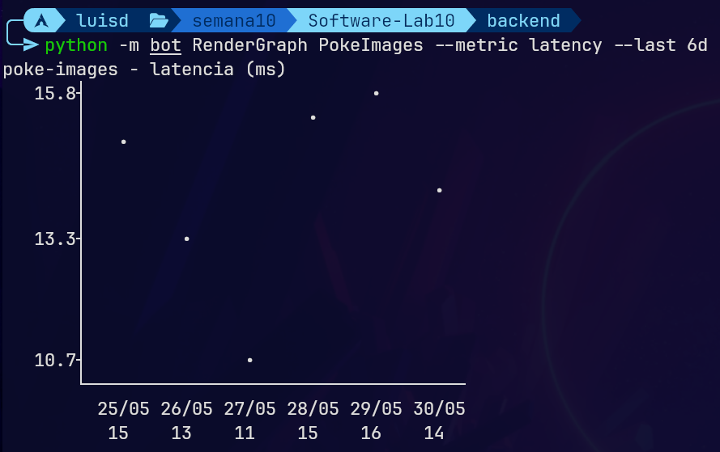

**`SearchApi`** — `python -m bot RenderGraph SearchApi --metric latency --last 6d`

```
search-api - latencia (ms)
18074.7┤   •• 
       │ • · ·
       │ ··· ·
       │ ··· ·
       │ ··· ·
       │ ··· ·
14317.4┤ ··· •
       │ ·•   
       │ ·    
       │ ·    
       │ ·    
10560.1┤•     
       └──────
        222223
        567890
        //////
        000000
        555555
```

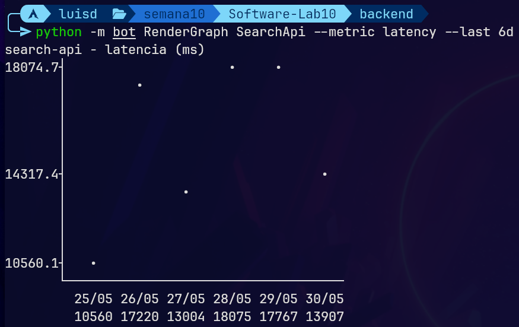

---

### `Stats`

Muestra métricas agregadas para el módulo sobre todo el rango:

- **P95 latency** — latencia en el percentil 95 de los requests.
- **Requests/min** — throughput promedio (requests / minutos del rango).
- **Error ratio** — porcentaje de requests con `http_status >= 500`.
- **Throughput** — total de requests en el rango.
- **Top failing API** — endpoint con más fallos 5xx (cantidad entre paréntesis).

**Sintaxis**:

```bash
python -m bot Stats <Módulo> [opciones de tiempo]
```

#### Evidencia por servicio

**`PokeApi`** — `python -m bot Stats PokeApi --last 6d`

```
P95 latency:        16264ms
Requests/min:       0.37
Error ratio:        31.12%
Throughput:         3,162
Top failing API:    /pokemon/{name} (984 5xx)
```

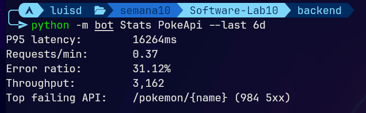

**`PokeStats`** — `python -m bot Stats PokeStats --last 6d`

```
P95 latency:        15528ms
Requests/min:       0.37
Error ratio:        36.55%
Throughput:         3,168
Top failing API:    /stats/{name} (1158 5xx)
```

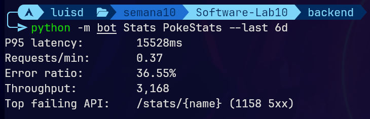

**`PokeImages`** — `python -m bot Stats PokeImages --last 6d`

```
P95 latency:        32ms
Requests/min:       0.37
Error ratio:        0.00%
Throughput:         3,156
Top failing API:    - (0 5xx)
```

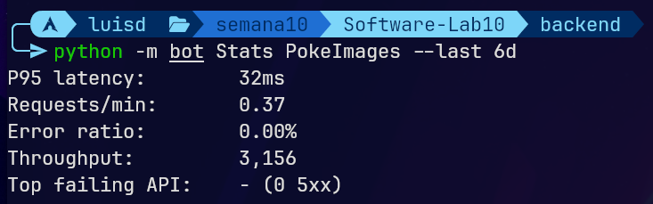

**`SearchApi`** — `python -m bot Stats SearchApi --last 6d`

```
P95 latency:        23514ms
Requests/min:       0.70
Error ratio:        47.61%
Throughput:         6,036
Top failing API:    /poke/search (2874 5xx)
```

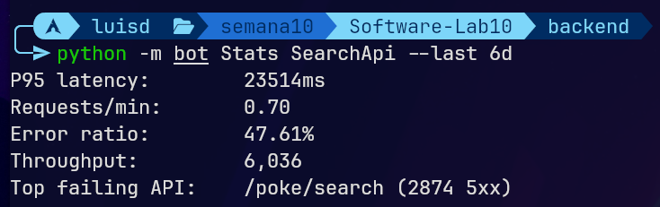

---

## Manejo de errores

- **Módulo desconocido** → el bot termina con código 2 y mensaje claro:

  ```bash
  $ python -m bot CheckAvailability PokeFoo --last 1d
  error: Unknown module 'PokeFoo'. Valid modules: poke-api, poke-stats, poke-images, search-api
  ```

- **Rango inválido** (`--from` posterior a `--to`) → exit code 2 con mensaje explicativo.
- **Día sin archivo de log** → se omite en silencio; aparece como `N/A` para `CheckAvailability` y `CheckLatency`, y simplemente no contribuye a `Stats` o `RenderGraph`.

---

## Ayuda integrada

```bash
python -m bot --help                       # listado de comandos
python -m bot CheckAvailability --help     # opciones del comando
python -m bot Stats --help
```
